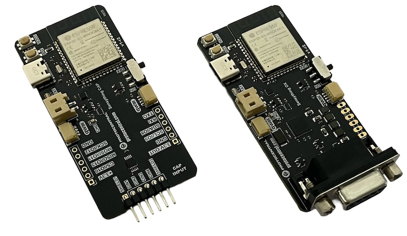

# Protocentral Sensything Arduino Library

[](https://opensource.org/licenses/MIT)
[](https://www.arduino.cc/reference/en/libraries/)


A unified platform library for the SensythingES3 family of ESP32-S3 sensor boards from Protocentral Electronics.



## Overview

The SensythingES3 library provides a consistent, modular API for all SensythingES3 boards, including:

- **SensythingCAP**: 4-channel capacitance measurement using FDC1004 
- **SensythingOX**: PPG/SpO2/HR measurement using AFE4400

All boards share common ESP32-S3 hardware and communication infrastructure while supporting board-specific sensors through inheritance-based polymorphism.

## Features

- **USB Serial Streaming**: CSV format with emoji prefixes for easy debugging
- **BLE Streaming**: OPENVIEW protocol compatible (Phase 2)
- **WiFi Streaming**: WebSocket real-time data + web dashboard (Phase 3)
- **SD Card Logging**: High-speed SDIO logging with CSV format (Phase 2)
- **Unified API**: Same code structure across all Sensything boards
- **Configurable**: Sample rate, interfaces, and output formats
- **Command Interface**: Interactive commands via Serial/BLE/WiFi

## Installation

### Via Arduino Library Manager (Recommended)

1. Open Arduino IDE
2. Go to **Sketch > Include Library > Manage Libraries**
3. Search for "SensythingCore"
4. Click **Install**

### Manual Installation

1. Download the latest release from [GitHub](https://github.com/Protocentral/SensythingCore)
2. Extract to your Arduino libraries folder:
   - Windows: `Documents\Arduino\libraries\`
   - Mac: `~/Documents/Arduino/libraries/`
   - Linux: `~/Arduino/libraries/`
3. Restart Arduino IDE

## Quick Start - SensythingCAP

```cpp
#include <Sensything.h>

// Create Sensything Cap instance
SensythingCap sensything;

void setup() {
    // Initialize platform (sensor + USB streaming)
    sensything.initPlatform();
    
    // Optional: Set custom sample rate (default 10Hz)
    sensything.setSampleRate(50);  // 20Hz
}

void loop() {
    // Handle measurements and streaming
    sensything.update();
}
```

That's it! The board will now stream 4-channel capacitance data via USB Serial.

## Quick Start - SensythingOX

```cpp
#include <Sensything.h>

// Create Sensything OX instance
SensythingOX sensything;

void setup() {
    // Initialize platform (sensor + USB streaming)
    sensything.initPlatform();
    
    // Optional: Set fast sample rate for PPG (default 10Hz)
    sensything.setSampleRate(8);  // 125Hz (8ms interval)
}

void loop() {
    // Handle measurements and streaming
    sensything.update();
}
```

**Note**: OX board requires `Protocentral_AFE44xx` library. Install from Arduino Library Manager or manually copy the AFE44xx library to your Arduino libraries folder. See `docs/PHASE4_OX_IMPLEMENTATION.md` for details.

## Hardware Requirements

### Sensything Cap
- ESP32-S3-WROOM-1 module (8MB Flash, 2MB PSRAM)
- FDC1004 capacitance sensor (onboard)
- SD card slot with SDIO interface
- QWIIC I2C connectors
- USB-C for power and data

### Sensything OX
- ESP32-S3-WROOM-1 module (8MB Flash, 2MB PSRAM)
- AFE4400 PPG/SpO2 sensor (onboard)
- SD card slot with SDIO interface
- USB-C for power and data

### Arduino IDE Settings (ESP32-S3)
- Board: **ESP32S3 Dev Module**
- USB Mode: **Hardware CDC and JTAG**
- USB CDC on Boot: **Enabled**
- Upload Mode: **UART0 / Hardware CDC**
- PSRAM: **QSPI PSRAM**
- Partition Scheme: **Huge APP (3MB No OTA/1MB SPIFFS)**
- Upload Speed: **921600**

## Dependencies

### Required Libraries (Cap Board)
- [ProtoCentral FDC1004 Capacitive Sensor Library](https://github.com/Protocentral/ProtoCentral_fdc1004_breakout) - FDC1004 sensor driver

### Required Libraries (OX Board)
- [ProtoCentral AFE4490 PPG and SpO2 boards library](https://github.com/Protocentral/protocentral-afe4490-arduino) - AFE4400 sensor driver ✅

## API Reference

### Core Methods

```cpp
// Initialization
bool initPlatform();                    // Initialize everything
bool initSensorOnly();                  // Sensor only, no communication

// Interface Control
void enableUSB(bool enable);
void enableBLE(bool enable);
void enableWiFi(bool enable, const char* ssid = nullptr, const char* password = nullptr);
void enableSDCard(bool enable);
void enableAll();
void disableAll();

// Measurement Control
bool setSampleRate(unsigned long intervalMs);  // 20-10000ms
float getSampleRateHz();
void startMeasurements();
void stopMeasurements();
void resetMeasurementCount();

// Main Loop
void update();  // Call in loop()

// Commands & Status
void processCommand(String cmd);
void printStatus();
void printHelp();
```

### Available Serial Commands

Type these in Serial Monitor (115200 baud, Newline):

- `help` - Show available commands
- `status` - Display system status
- `start_all` - Enable all interfaces
- `stop_all` - Disable all interfaces
- `set_rate <ms>` - Set sample rate (e.g., `set_rate 100`)
- `reset_count` - Reset measurement counter

## Data Format

### USB Serial Output
```
📊 timestamp,ch0_pf,ch1_pf,ch2_pf,ch3_pf,capdac_0,capdac_1,capdac_2,capdac_3,status_flags,count
📊 1523,12.3456,15.6789,10.2345,13.4567,5,5,5,5,0x00,1
📊 1623,12.3478,15.6801,10.2367,13.4589,5,5,5,5,0x00,2
```

### Status Flags (Hex Bitmask)
- `0x01` - Channel 0 measurement failed
- `0x02` - Channel 1 measurement failed
- `0x04` - Channel 2 measurement failed
- `0x08` - Channel 3 measurement failed
- `0x40` - CAPDAC adjusting (normal during stabilization)

## Troubleshooting

### Sensor Not Detected
- Verify I2C connections (SDA=GPIO21, SCL=GPIO22)
- Check power supply (3.3V, sufficient current)
- Try scanning I2C bus with [I2C Scanner](https://playground.arduino.cc/Main/I2cScanner/)

### Compilation Errors
- Ensure ESP32 board support installed (Arduino Boards Manager)
- Update to latest ESP32 Arduino Core (2.0.0+)
- Verify all dependencies installed

### Upload Failures
- Press and hold BOOT button during upload
- Check USB cable (data-capable, not charge-only)
- Try lower upload speed (115200)

License Information
===================


This product is open source! Both, our hardware and software are open source and licensed under the following licenses:

Hardware
---------

**All hardware is released under the [CERN-OHL-P v2](https://ohwr.org/cern_ohl_p_v2.txt)** license.

Copyright CERN 2020.

This source describes Open Hardware and is licensed under the CERN-OHL-P v2.

You may redistribute and modify this documentation and make products
using it under the terms of the CERN-OHL-P v2 (https:/cern.ch/cern-ohl).
This documentation is distributed WITHOUT ANY EXPRESS OR IMPLIED
WARRANTY, INCLUDING OF MERCHANTABILITY, SATISFACTORY QUALITY
AND FITNESS FOR A PARTICULAR PURPOSE. Please see the CERN-OHL-P v2
for applicable conditions

Software
--------

**All software is released under the MIT License(http://opensource.org/licenses/MIT).**

THE SOFTWARE IS PROVIDED "AS IS", WITHOUT WARRANTY OF ANY KIND, EXPRESS OR IMPLIED, INCLUDING BUT NOT LIMITED TO THE WARRANTIES OF MERCHANTABILITY, FITNESS FOR A PARTICULAR PURPOSE AND NONINFRINGEMENT. IN NO EVENT SHALL THE AUTHORS OR COPYRIGHT HOLDERS BE LIABLE FOR ANY CLAIM, DAMAGES OR OTHER LIABILITY, WHETHER IN AN ACTION OF CONTRACT, TORT OR OTHERWISE, ARISING FROM, OUT OF OR IN CONNECTION WITH THE SOFTWARE OR THE USE OR OTHER DEALINGS IN THE SOFTWARE.

Documentation
-------------
**All documentation is released under [Creative Commons Share-alike 4.0 International](http://creativecommons.org/licenses/by-sa/4.0/).**


You are free to:

* Share — copy and redistribute the material in any medium or format
* Adapt — remix, transform, and build upon the material for any purpose, even commercially.
The licensor cannot revoke these freedoms as long as you follow the license terms.

Under the following terms:

* Attribution — You must give appropriate credit, provide a link to the license, and indicate if changes were made. You may do so in any reasonable manner, but not in any way that suggests the licensor endorses you or your use.
* ShareAlike — If you remix, transform, or build upon the material, you must distribute your contributions under the same license as the original.

Please check [*LICENSE.md*](LICENSE.md) for detailed license descriptions.
